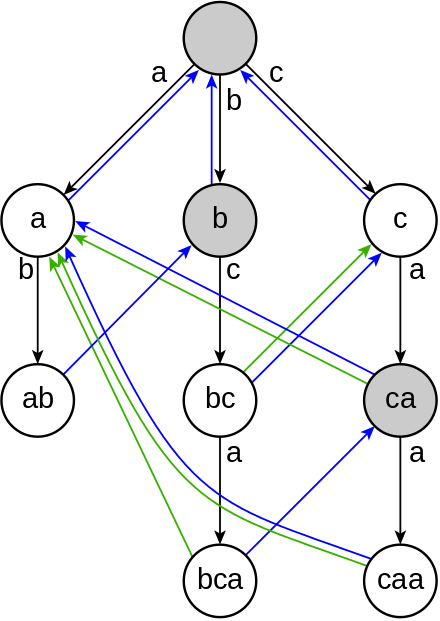

# Problem

[https://www.hackerrank.com/challenges/determining-dna-health]

## Algorithm

The bulk of the cost is finding each gene in the range of the DNA strand limits within the DNA strand string. A brute force approach is simple but suboptimal.

My first optimization was to group all unique genes into a map where the genes were the keys and the values were arrays of pairs of health values and the index of the health value in the original array:

```txt
{ 
    gene_a:
        [ 
          (health, gene_index), 
          (health, gene_index), 
           ... 
        ]
    gene_b:
        [ 
          (health, gene_index), 
          (health, gene_index), 
           ... 
        ]
    ...
}
```

With that structure, it was possible to avoid looking up the same repeated gene in the DNA strand multiple times  - the rate of repetition for a gene was in the hundreds in some of the larger samples.

There were fewer timeouts with that approach, but it was clear that further grouping the consolidated structure by individual characters would minimize waste. For example, if a gene "b" could not be found in the strand, there was no point in searching for any gene containing the word "b."

This challenge started to feel like a lot of work for a weekend puzzle, so I peeked into the discussion section, where someone mentioned the [Aho-Corasick algorithm](https://en.wikipedia.org/wiki/Aho%E2%80%93Corasick_algorithm), which was more elegant and efficient approach than I was envisioning (no surprise for a well-established algorithm surviving several decades of scrutiny.)

|  |
|:--:|
| Credit to Wikipedia |

At that point, with more than an hour already invested in the problem, I just looked up the algorithm implementation in Python. I adapted it to calculate the DNA strand health on each match to a gene instead of appending the matched position to the results.

Performance was much improved, with one of the examples with 100K genes getting processed in 14 seconds on my machine versus 58 seconds with my first optimization.

## Timeouts

Even with the more appropriate algorithm and the improvements, there were still (fewer) test case timeouts.

Using a different programming language, such as Java and - most definitely - C, with the same algorithm would do short work of the timeouts. However, I set out to solve all challenges with Python, so I resigned to taking a 16% hit on the total score (41.5 points out of 50) for this one and moved on to the next challenge.
