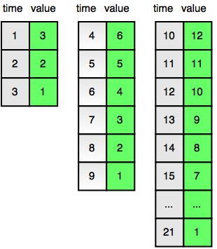

# Problem

[https://www.hackerrank.com/challenges/strange-code]

## Algorithm

The key to solving this problem starts with the quadratic nature of _"the timer resets to 2x the initial number for the prior cycle"_.



With the "value" column in the illustration being clearly a multiple of 3 (3,6,12,...), I started from the assumption that the solution revolved around multiplying 3 by 2^n, where `n` is the cycle, starting with 0.

In fact, it is clear that the starting value in each cycle is exactly `3 * 2 ^ n`.

I also noticed that subtracting `t` from the starting value of the next cycle gets us close the t value we want, so the **starting value in the next cycle is: `3 * 2^(n + 1)`**. This is the **first formula.**

Since values decrease in each cycle, and looking at the example table in the problem, it is also clear that **`t + value` is constant in each cycle and equal to the starting value of the next cycle - 2**.

In other words, given the starting value in the next cycle, `t + value = starting-value-in-next-cycle - 2 = 3 * 2 ^ (n + 1) - 2`. This is the **second formula.**

```txt
t = 3 * (2 ^ n) + 2

Resolving for n:
t - 2 = 3 * (2 ^ n)
(t - 2 / 3) = 2 ^ n
log2(t - 2 / 3) = n

In Python:
n = math.floor(math.log((t+2)/3,2))
```

Now we know the cycle where `t` happens, so we need to apply the second formula, resolving for value (represented as `v` below)

```txt
t + v = 3 * 2 ^ (n + 1) - 2
v = 3 * 2 ^ (n + 1) - 2 - t
```
